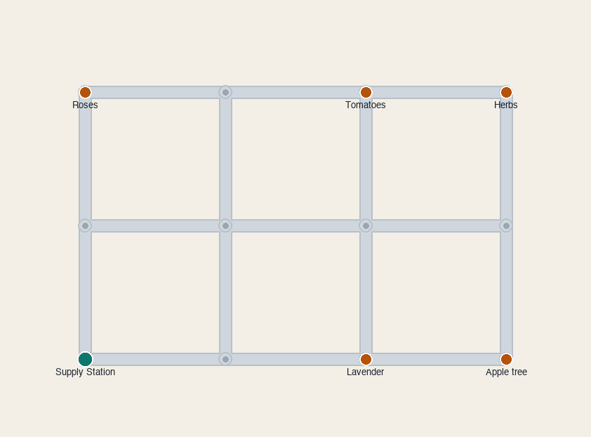
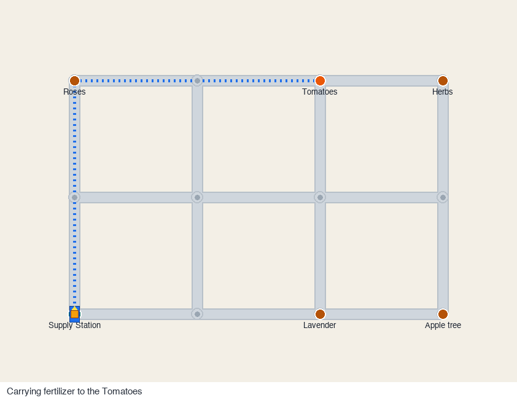

# 花园养护机器人

*[English](README.md) | 中文*

[](LICENSE)

一个负责给花园里的植物浇水、施肥的小机器人。你选一株植物，它就从供给站规划出最短路线，沿着花园小径开过去，放下一份水或肥料，再开回来。我写它是想搞清楚养护机器人的两半是怎么配合的：一半是选路线的规划器，一半是把路线走完的控制器。它是个软件模型，不是真机器人上的固件。



## 工作原理

花园小径是一张带权图：路口是节点，每段小径是边，每条边的权重就是它的长度。**Dijkstra 算法** 从供给站到你选的植物找出最短路线。机器人再沿着这条路线一个路口一个路口地开，用一个简单的比例控制器朝下一个路口转向，配上差速驱动的运动模型。它在拐弯前会先松一点油门，好让自己不偏出小径。每个路口上的“决策”就是拐上通往计划里下一个节点的那条小径：全局规划负责选弯，局部控制负责把弯拐到位。

更详细的说明在 [docs/how-it-works.zh-CN.md](docs/how-it-works.zh-CN.md)。

## 这个仿真

它是纯 Python：用 `numpy` 算数、用 `Pillow` 画帧，所以在命令行里就能跑。跑一次会生成一张养护过程的动图：蓝色虚线是规划出的路线，机器人身上的黄色方块是它携带的水或肥料，状态栏会显示它正在做什么。



机器人在供给站取上一份水或肥料，送到植物那里，放下，完成一次灌溉或一次施肥，再空车返回，然后准备接下一次养护。

重新生成动图和静态地图：

```bash
python -m delivery_robot.render media
```

## 浏览器演示

[`web/`](web/) 里还有一个小小的浏览器播放器，它只负责播放：由 Python 引擎用 Dijkstra 规划每一次养护、用控制器把它开完，再把结果导出成 JSON（花园的图、每一段的节点路径、以及机器人每一帧的位姿）。网页加载这些数据，在 `<canvas>` 上回放出来，带植物选择、播放/暂停、速度滑块和状态栏。浏览器里不重新规划、也不重新仿真，只是把引擎已经算好的帧画出来。播放器是纯 JavaScript 加 Canvas，不依赖任何库。

生成引擎要导出的数据：

```bash
python -m delivery_robot.export web/data   # 或者：make data
```

然后把这个目录当静态站点跑起来打开：

```bash
python -m http.server   # 再访问 http://localhost:8000/ （会跳转到 web/）
```

界面按钮带 English / 中文 切换；地图上画出来的植物名保持英文。

## 运行测试

规划和行驶逻辑都能脱离渲染、在无界面下跑：

```bash
python tests/run.py
# 装了 pytest 的话也可以：
pytest tests/run.py
```

测试会拿 Dijkstra 和一个独立的 Floyd-Warshall 实现对账（在这座花园上，也在几百张带种子的随机图上，包括不连通的图），检查它返回的每条路线都是一条长度对得上的真实路径，并把机器人在整个速度范围内开到每一株植物，确认它不偏出小径、能到达。

## 目录结构

```
delivery_robot/   仿真包（graph、planner、controller、town、simulate、render、export）
tests/            无界面测试套件（run.py）
docs/             更详细的原理说明
media/            这里用到的动图和静态地图
web/              浏览器播放器（index.html、player.js、style.css）和导出的 data/
```

## 环境要求

Python 3.9 及以上，需要 `numpy` 和 `Pillow`。

## 许可

MIT，见 [LICENSE](LICENSE)。作者 Jiayi Mu（[github.com/jiayimu007](https://github.com/jiayimu007)）。
